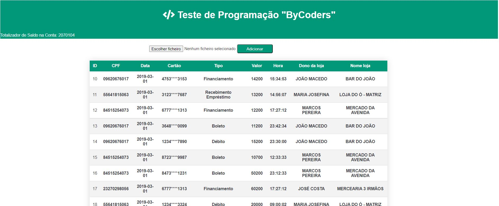

#Web-Financeiro

Web-Financeiro é uma aplicação desenvolvido com intuito de testar e avaliar os conhecimentos técnicos em programação de vários profissionais. O teste consiste em parsear este arquivo de texto(CNAB) e salvar suas informações em uma base de dados a critério do candidato.
Esse project está dividido em duas partes: 
- Web-Financeiro (Praticamente serveu de front-end que basicamente faz a passagem dos dados contido no ficheiro .txt para API) 
- API-Financeiro (É a nossa API que recebe toda informação e dá o seu devido tratamento e armazena na base de dados).

### Acesso a base de dados:
Para acessar o Web-Financeiro temos url local: http://localhost:3333/visualizar-financas e o API-Financa é acessado com o endereço: http://localhost:8182/swagger-ui.html#/. De lembrar que a API utiliza o documento swagger para facilitar no acesso a todos endpoints. 
OBS: As entidade são geradas pela hibernate, mas a base de dados tem ser criada manualmente com o nome "db_bycoders" 

spring: 
  datasource: 
    driverClassName: com.mysql.jdbc.Driver 
    url: jdbc:mysql://localhost:3306/db_bycoders 
    username: root 
    password: 
  jpa: 
    hibernate.ddl-auto: update 
    database-platform: org.hibernate.dialect.MySQL57Dialect 
    generate-ddl: true 
    show-sql: true 
    
### Endpoints:
- (POST): /finance/create
- (DELETE): /finance/delete{id}
- (GET): /finance/findAll
- (GET): /finance/findById{id}
- (POST): /transact/findById{id}
- (GET): /transact/findAll

### Testes Unitários:
Para os testes unitários foram feitas quatros testes de unidade simples com Junit reaproveitando alguns métodos implementados na classe FinanceserviceImpl:
- verificarListaPrenchida: Esse método verifica se existem elementos preenchidos na base de dados.
- calcularSaldo: Faz um somátorio de quanto de saldo tem e depois faz a comparação com um valor colocado com parametro.
- verificarListaVazia: Veifica se exite elementos na lista.
- pesquisaFinancaPorId : Faz uma busca de um elemento na base de dados por id.

### Tecnologias ou Ferramentas Utilizadas:
- Linguagem: Java  
- Base de Dados: Mysql  
- Framework: Spring  
- API: Rest  
- IDE: Intellij  
- ORM: Hibernate  
- Estilo: CSS puro  
- Teste Unitário: Junit
- Documento API: Swagger 

### Classes e Entidades:
Para o nosso Diagrama Entidade e Relacionamento temos duas entidades (transact e finance) normalizadas com relacionamentos um para muitos geradas apartir de classes Java com ORM Hibernate. 
- Finance
- Transact
### Funcionamento da Aplicação
 Para armazenar os dados do ficheiro na base de dados temos os seguintes passos:
- Escolher ou selecionar o ficheiro em qualquer parte do computador 
- Clicar no botão Adicionar para fazer o upload do arquivo no projeto
- Se nenhum arquivo for adiciondo no projeto ou nenhum upload feito, aparece uma notificação
- 
### Print das Telas
 

