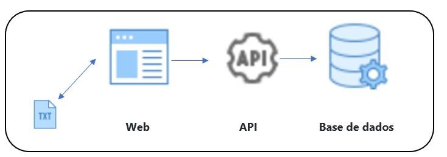

#Web-Financeiro

Web-Financeiro é uma aplicação desenvolvido com intuito de testar e avaliar os conhecimentos técnicos em programação de vários profissionais. O teste consiste em parsear este arquivo de texto(CNAB) e salvar suas informações em uma base de dados a critério do candidato.
Esse project está dividido em duas partes: 
- Web-Financeiro (Praticamente serveu de front-end que basicamente faz a passagem dos dados contido no ficheiro .txt para API) 
- API-Financeiro (É a nossa API que recebe toda informação e dá o seu devido tratamento e armazena na base de dados)

Para acessar o Web-Financeiro temos url local: http://localhost:3333/visualizar-financas e o API-Financa é acessado com o endereço: http://localhost:8182/swagger-ui.html#/. De lembrar que a API utiliza o documento swagger para facilitar no acesso a todos endpoints.
###Endpoints:
- (POST): /finance/create
- (DELETE): /finance/delete{id}
- (GET): /finance/findAll
- (GET): /finance/findById{id}
- (POST): /transact/findById{id}
- (GET): /transact/findAll

###Arquitetura:
Arquitetura utilizada para o desenvolvimento do projecto foi a arquitetura em camada onde todo mapeamento é feito pelo
"controller", passando pela interface "service" e todos métodos implementados pelo "impl".

### Tecnologias ou Ferramentas Utilizadas:
- Linguagem: Java  
- Base de Dados: Mysql  
- Framework: Spring  
- API: Rest  
- IDE: Intellij  
- ORM: Hibernate  
- Estilo: CSS puro  
- Estrutura: HTML 5  

